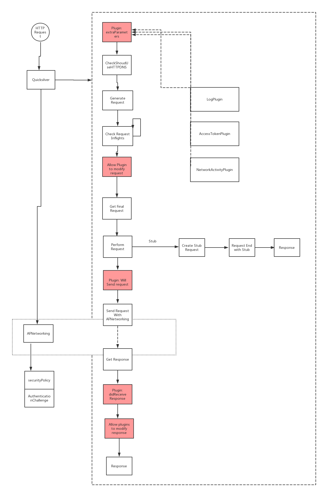

## Quicksilver 网络库

### 介绍

`Quicksilver` 提供网络通讯相关服务，目前包括 HTTP 及 WebSocket。

### Requirements

最低运行版本：iOS 10.0

编译语言版本：Swift 5.0

IDE版本：Xcode 10.2

### HTTP 支持功能

1. 支持 HTTP Request，上传和下载服务
2. 支持配置 HTTP 是否开启 HTTPDNS 服务
3. 支持自定义日志输出，支持 cURL 方式的日志输出
4. 支持 HTTPS 请求证书本地校验
5. Network Response 支持函数式调用，支持对 Empty Data 的额外处理
6. 支持 API 请求的 Stub
7. 支持对每一个 Request 高度定制，和在生命周期任意阶段 Inject
8. 支持 Network Reachablity

### WebSocket 支持功能

1. 支持配置开启 HTTPDNS

### 设计

`Quicksilver` 的内部实现基于 `AFNetworking`, 并在此基础上封装了一套类`Moya`的接口。

其中红色方块的四个步骤定义 Plugin 接口，供外部注入。

### 使用

参考 Demo Target。