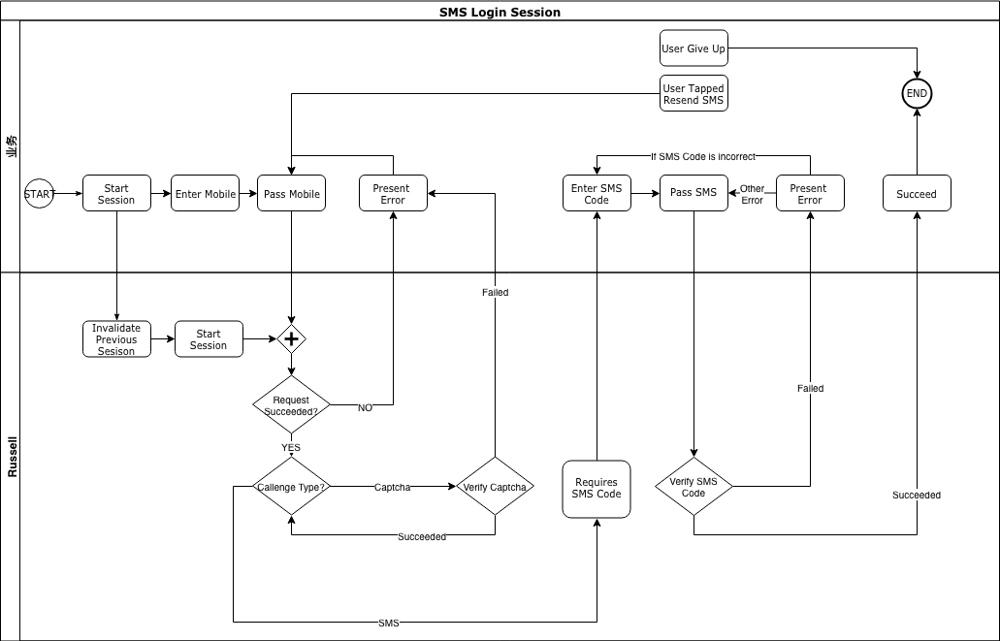

## Introduction

流利说 App 统一登录服务 [Russell](https://wiki.liulishuo.work/pages/viewpage.action?pageId=26579711) 的 iOS 客户端接入方案。

## Features

对接 [Russell 的相关接口](https://git.llsapp.com/common/protos/tree/master/liulishuo/backend/russell/v2)，并提供 Token 管理。

## Requirements

最低运行版本：iOS 10.0  
编译语言版本：Swift 4.2.1

## How to Use

### Token 管理

Russell 内部更新了 Token 管理策略，通过外部注入一个 `TokenStorage` 来提供 Token 保存和迁移的功能。

#### 注意事项
- `TokenStorage` 只用于注入，除特别的需求外（如 Liulishuo App 的灰度方案），切勿在业务代码中直接操作（读/写 token）注入到 Russell 当中的 `TokenStorage` 。
- Russell Token 不同于原 Neo Token，有有效期和过期后刷新 Token 的机制，因此:
	- 业务代码不要将 API 返回的 Token 单独另存一份，这会引起出发 `refreshToken` 操作后的 Token 不一致问题
	- 业务代码需要处理 HTTP Response 401 / 403 之后先尝试 `refreshToken` 再确定要不要登出(`refreshToken` 回调 `RussellError.RefreshToken.notLoggedIn` or `RussellError.RefreshToken.invalidToken`)
	- 业务代码只通过 `Russell.authorizationToken()` 方法来获取当前保存下来的 Russell Token。该方法在被调用时，会根据配置 `autoRefreshThreasholdBeforeExpiring` 在 Token 过期前 x 秒时尝试自动刷新 Token。
	- `Russell.refreshToken(_:)` 内部做了防重入处理，多次连续调用只会触发一次请求，但每次调用均会收到回调结果。
	- `KeychainTokenStorage` 在 App 被删除再安装时依然存在，需要各业务组注意下，是不是要通过 `accessToken` 有效来判定用户的登录状态，通常是不建议的
	- 从 neo token 升级到含 Russell 的版本时，主动触发 `refreshToken` 可以将原 neo token 替换成 russell token.

### Setup

Russell 服务需要初始化：

``` swift
// 服务
static Russell.setup(configuration:)
// UI
static Russell.UI.theme // 视觉主题
static Russell.UI.headsUpDisplay // 可供 Russell 使用的 Heads Up Display (HUD)
``` 

然后就可以通过 `Russell.shared` 来使用 Russell 的服务。

- `urlConfiguration` 是中台服务的 URLs 配置，`host` 表示服务器地址，`usesHTTPDNS` 表示 Russell 请求是否使用 HTTPDNS。Russell 默认提供了 `URLConfiguration.defaultDev`, `URLConfiguration.defaultStaging` 和 `URLConfiguration.defaultProduction`
- `poolID` 对应登录服务的规则，各业务需要根据自己的需求向 platform team 申请对应的 poolID，具体请咨询 @huiyong.cui 。
- `deviceID` 是当前设备的唯一 ID，推荐使用 `LingoUDID.LingoCommonUDID.deviceId()` 或根据业务方自己的封装使用
- `tokenStorage` 注入 Auth Token 存储器，对应 `protocol TokenStorage`。Russell 默认提供 `KeyChainTokenStorage`。要迁移 token 的旧业务需要自己实现相应的 `TokenStorage`。
- `autoRefreshThreasholdBeforeExpiring` Token 过期前 x 秒内尝试自动刷新当前 token
- `dataTracker` 注入 Russell 内部 UI 使用的打点服务。可以参考 [Demo RussellTracker 实现](Russell/RussellDemo/AppDelegate.swift#L159)。
- `privacyAction` 隐私协议跳转回调。入参为 `UINavigationController` 表示当前 Russell 内部 UI 正在使用的 Naviagtion Controller。业务可以选择使用或不使用

#### Work With Quicksilver

Russell 额外提供一个 `RefreshTokenOn401Or403Plugin` 的 Quicksilver 插件，用于处理 401 / 403 Response Code，参见 <https://wiki.liulishuo.work/pages/viewpage.action?pageId=16567624#id-接入说明-客户端接入> 。

业务组可以选择 

1. `QuicksilverProvider.init(configuration:plugins:callbackQueue:)` plugin 参数中加入一个 `RefreshTokenOn401Or403Plugin` 
2. 自己实现对应的逻辑，根据业务需求来处理 401 / 403 的问题。[参考代码](Russell/Russell/QuicksilverPlugin.swift#L17)

如果使用 `RefreshTokenOn401Or403Plugin`，需要改变原来"收到 401 Status Code 即触发自动登出流程"的逻辑，替换为在 `RefreshTokenOn401Or403Plugin.refreshTokenFailedAfter401Or403Callback` 的回调中触发自动登出的流程。

### Session

Russell 的任何行为都被定义为一个 Session，每当外部尝试启动一个新的 Session 时，都会将当前 Session 废弃，以避免 Token 访问冲突。由于 Russell Session 是一个低频活动，因此这样

`Russell` singleton 下的 API 文档都会说明，该 API 是否启动一个 Session，使用时请注意。

### 短信验证码登录

短信验证码登录流程如下:



使用流程为：

**1. 启动 Session**

通过 `Russell.startSMSLoginSession(mobile:delegate:isSignup:)` 来启动一个 `SMSLoginSession`，向服务器请求发送短信验证码。

**2. 处理短信验证码发送结果**

如果成功，则会收到 `CodeVerificationSessionDelegate.sessionRequiresVerificationCode(_:)` 的回调。之后需要业务方引导用户输入收到的短信验证码。

该过程进行期间，根据 `poolID` 配置，还可能会有展示第三方验证码的过程，而任何一个环节出错，则会收到 `LoginSessionDelegate.loginSession(_:failedWithError:)` 的回调，业务方需要根据[错误](#错误)类型来处理对应的业务逻辑。

**3. 校验短信验证码**

将用户输入的验证码传入 `CodeVerificationSession.verify(code:)` 来向服务器发送校验短信验证码的请求。

请求成功后有两条路径: 

- 通过 `LoginSessionDelegate.loginSession(_:succeededWithResult:)` 将结果回调给业务方。
- 跳转到 [确认注册账号](#确认注册账号)

请求失败后，业务方需要处理 `LoginSessionDelegate.loginSession(_:failedWithError:)` 中的错误。如果需要重新发送验证码，则调用 `CodeVerificationType.resendVerificationMessage()` 重新发送验证码，并回到步骤二。

**4. 确认注册账号**

### OAuth 登录

调用 `Russell.startOAuthLoginSession(auth:delegate:isSignup:)` 启动一个 OAuth Session
，当前请求成功会有两种回调: 

- `LoginSessionDelegate.loginSession(_:succeededWithResult:)` 返回登录结果
- 跳转到 [确认注册账号](#确认注册账号)

请求失败触发 `LoginSessionDelegate.loginSession(_:failedWithError:)` 回调。

其中，`auth` 定义为 `OAuth`，目前包含 `CodeOAuth` 和 `ImplicitOAuth` 两种。Russell 目前封装了 `WechatAuth` `QQAuth` `WeiboAuth` 三种第三方登录鉴权，业务方需要将第三方 SDK 或 `Loki` 返回的认证结果转换成对应的 `OAuth` 结构。

### 确认注册账号

如果你的业务 poolID 对应的配置是 "未注册手机号/第三方账号尝试登录时，不自动注册账号"，且创建 `SMSLoginSession` / `OAuthLoginSession` 的 `isSignup` 参数值为 `false`，则在前置验证流程成功的前提下，会触发 `TwoStepRegistrationLoginSessionDelegate.loginSession(_:requiresUserToConfirmRegistrationWithExtraInfo:)` 的回调。

业务方在收到该回调后，需要通知用户确认是否创建账号。用户确认后，通过调用 `TwoStepRegistrationLoginSession.confirmRegistration()` 来确认创建账号，创建成功后会回调 `LoginSessionDelegate.loginSession(_:succeededWithResult:)`

### 账号/密码登录

调用 `Russell.startPasswordLoginSession(account:password:delegate:isSignup:)`。delegate 只会回调成功/失败。

### 绑定第三方账号 (OAuth)

调用 `Russell.startBindOAuthSession(auth:delegate:)`。其他细节同 OAuth 登录。

### Sign in with Apple

1. 设置 Entitlements 文件，在 capabilities 中添加 sign in with apple
2. 添加 sign in with apple 按钮到登录界面（必须在其他第三方登录之前，否则可能导致审核不过）
3. 开启 appleid 登录授权流程
4. 授权认证成功后，将 userID 存入 Keychain 中，并调用注册/登录接口
5. 在合适地方进行授权观察以便授权成功后再次进入 app 时不用重复授权

### 绑定手机号

基本流程如下:

1. `Russell.startBindMobileSession(mobile:delegate:)` 开始绑定流程
2. 回调 `CodeVerificationSessionDelegate.sessionRequiresVerificationCode(_:)` 让用户输入验证码
3. `CodeVerificationSession.verify(code:)` 向后端验证用户输入的验证码是否正确
4. 回调成功 `BindSessionDelegate.sessionSucceeded(_:)` 或失败 `BindSessionDelegate.session(_:failedWithError:)`

### 绑定邮箱

1. `Russell.startBindEmailSession(email:delegate:)` 开始绑定
2. 回调 `CodeVerificationSessionDelegate.sessionRequiresVerificationCode(_:)` 让用户输入验证码
3. `CodeVerificationSession.verify(code:)` 向后端验证用户输入的验证码是否正确
4. `BindEmailSessionDelegate.sessionRequiresPassword(_:)` 需要提示用户设置密码
5. `BindEmailSession.setPassword(_:)` 设置密码
6. 回调成功 `BindSessionDelegate.sessionSucceeded(_:)` 或失败 `BindSessionDelegate.session(_:failedWithError:)`

### 重置密码

重置密码有两种方式

#### 通过(短信/邮箱)验证码重置

1. `Russell.startResetPasswordSession(email:delegate:)` 或者 `Russell.startResetPasswordSession(mobile:delegate:)` 启动通过 email 或 mobile 重设密码的流程
2. 回调 `CodeVerificationSessionDelegate.sessionRequiresVerificationCode(_:)` 要求用户输入收到的邮件/短信验证码
3. `CodeVerificationSession.verify(code:)` 验证用户输入的验证码
4. 回调 `ResetPasswordSessionDelegate.sessionRequiresPassword(_:)` 提示用户输入新密码
5. `ResetPasswordSession.setPassword(_:)` 设置新密码
6. 回调成功 `ResetPasswordSessionDelegate.session(_:succeededWithResult:)` 或失败 `ResetPasswordSessionDelegate.session(_:failedWithError:)`

#### 通过旧密码重置

1. `Russell.startUpdatePasswordSession(old:new:delegate:)` 等待回调即可。密码要求 ≥8 位，且必须包含字母和数字

### 登出

`Russell.logout()` 登出即可，没有回调

### 实名认证

#### 背景

[实名认证流程设计](https://wiki.liulishuo.work/pages/viewpage.action?pageId=64739702)

[实名认证 API 文档](https://wiki.liulishuo.work/pages/viewpage.action?pageId=64739456)

实名认证需要集成以下几个功能:

#### 配置

[Russell setup 配置](#setup) 增加了 `privacyAction` (用户隐私协议展示回调) 和 UI 配置 (`Russell.UI.theme` & `Russell.UI.headsUpDisplay`)

#### 新注册用户 (Email + Password / 第三方登录) 须绑定手机

oauth login 和 password login 新增参数 `hasUserConfirmedPrivacyInfo` 表示用户是否同意过隐私协议 (或是否勾选☑️"同意隐私协议"选项，具体按需求处理)

`OAuthLoginSessionDelegate` 和 `PasswordLoginSessionDelegate` 需要实现 `RealNameCertificationSessionDelegate` 相关的方法

- `RealNameCertificationSessionDelegate.sessionRequiresRealNameCertification(_:)` (optional: 隐藏 HUD，然后) 返回用于展示实名认证容器，一般推荐用 `Russell.UI.Container.presentation(viewController)`

触发实名认证流程，由 Russell SDK 接管 UI 流程，并在结束后回调 Login Success.

#### 已注册/登录但未绑定手机的用户需要在合适的时机提醒用户绑定手机

在合适的时机调用 `Russell.fetchRealNameInfo(checksExpirationDate:completion:)` 获取用户实名认证信息，并根据回调给出相应的提示，具体实现可以参考 Demo

``` swift
Russell.shared?.fetchRealNameInfo { result in
  guard let controller = self.window?.rootViewController,
    let info = try? result.get(),
    info.needsBinding
    else { return }
  let config = info.toBindingConfiguration(hasUserConfirmedPrivacyInfo: false)
  Russell.UI.warnRealName(in: .presentation(controller), message: info.message, configuration: config, completion: { _ in })
}
```

#### 查看已绑定手机

原 **"个人中心"** 或者其他可能会展示 **"已绑定手机"** , **"请绑定手机"** 等入口的界面，其 **跳转逻辑** 需要变更为:

``` swift
// container 推荐使用 `Russell.UI.Container.navigation(UINavigationController)`
Russell.UI.showBoundMobile(in: container)
```

之后的流程由 Russell SDK 接管。

### 阿里云手机号一键登录（大客户版本）

接入之前需要做的准备工作：

1. 在阿里云服务控制台添加授权方案并加入阿里云大客户白名单，可以找@崔会永
2. Other Linker Flags增加-ObjC，一定要添加此选项，注意是大写C，不是小写c，否则工程运行起来会crash！
3. 由于某运营商还存在http请求，所以请确保Targets->Info中ATS开关已开启，并设置为YES

基本流程如下:

1. 第一步，初始化初始化SDK并获取手机掩码及运营商相关协议信息，判断环境是否支持一键登录。`Russell.OneKeyLoginFlow.setAuthSDKInfo(key:phoneNumber:retriesOnceOnNetworkFailure:networkConnectionListeningTimeout:completion:)`
2. 第二步，唤起一键登录授权页，前提是初始化成功并返回运营商相关信息。`Russell.OneKeyLoginFlow.startWakeAuthorizationViewController(useType:completion:)`
3. 第三步，点击一键登录按钮开始登录流程。 `Russell.OneKeyLoginFlow.startLoginByToken(appID:fromViewController:useType:sessionID:completion:)`

注意事项：
1. 初始化需要在 `keywindow` 设置完成后调用
2. 定制的 ViewController 需要调用打点设置 `OneKeyLoginCustomModel.configLoginButton(vc.oneKeyLoginButton)
OneKeyLoginCustomModel.configChangeButton(vc.otherNumberLoginButton)`
3. 唤起一键登录页页时请调用 `Russell.OneKeyLoginFlow.startWakeAuthorizationViewController` 否则会丢失该页面的 PV 点

### 错误

Russell 封装了[接口文档](https://git.llsapp.com/common/protos/tree/master/liulishuo/backend/russell/v2)中描述的错误类型，详见 [Error.swift](Russell/Russell/Error.swift) 。

### Localization

Russell 提供了默认的 Error Message Localization 文案。如果业务方需要定制文案，可以通过给 `Russell.localizedStringTable` 赋值，并在对应的 `.strings` 文件中加入对应 key 值的文案即可。具体参见 [Russell.strings](Russell/Russell/zh-Hans.lproj/Russell.strings) 。

### 非 Session 功能

#### 获取用户信息

调用 `Russell.fetchUserInfo(_:)` 获取当前用户信息

#### 更新用户信息

调用 `Russell.updateUserInfo(original:updated:completion:)` 或者 `Russell.updateUserInfo(diff:completion:)` 来更新用户信息。其中后者的 `diff` 参数可以通过 `Russell.UserInfo.diff(from:)` 方法生成。

#### 获取四件套 Cookie 数组

调用 `Russell.getAuthenticationCookies()`。
